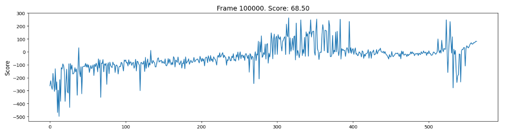
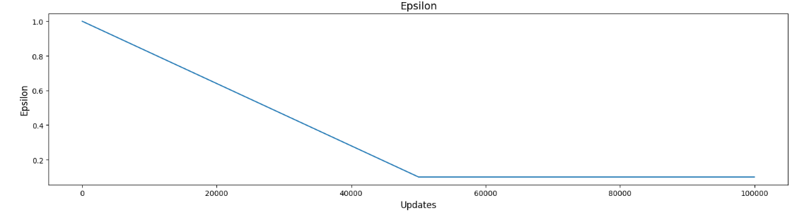
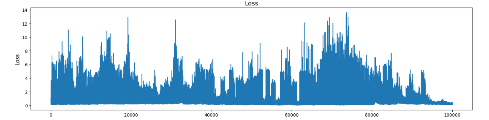

# Double DQN

Implemented the Double DQN ([David Silver et. al](https://arxiv.org/pdf/1509.06461)), a variant of DQN that uses two networks to reduce the over-estimation error from DQN by using a target DQN to keep the updates within the limits of the original DQN. 

## Environment 
Implementation was tested on `LunarLander-v2` environment of the OpenAI Gym. 

## Result of Training 
The epsilon was also decreased linearly from 1 to 0.1 in 50,000 steps. 
Double DQN shows a strong learning curve when we train it. We trained it on 1,00,000 steps i.e. almost 200 episodes (each episode contains at max 500 steps).

- Initially, it got very negative rewards due to large epsilon. However, the negative values gradually decreased.

- After 35,000 frames it started to earn positive overall reward for the first time. 

- In 50,000 frames, it almost earned >100 reward. 

- There were regular cases with negative rewards, which indicates that the agent was learning. 

- The plots:

## Test
We tested the agent and it scored 102.0 in an framework. 

## Result
Double DQN is way more faster and stable than DQN. In less than 200 episodes, we got almost 100 reward which is way more faster than DQN.

